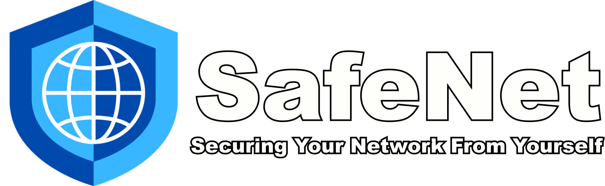

<a name="readme-top"></a>

<!-- PROJECT LOGO -->
<br />
<div align="center">
  <a href="https://github.com/cyberark/SafeNet">
    
  </a>

  <p align="center">
    <!-- <br />
    <a href="https://github.com/cyberark/SafeNet"><strong>Explore the docs »</strong></a> -->
    <br />
    <br />
    <!-- <a href="https://github.com/cyberark/SafeNet">View Demo</a>
    · -->
    <a href="https://github.com/cyberark/SafeNet/issues">Report Bug</a>
    ·
    <a href="https://github.com/cyberark/SafeNet/issues">Request Feature</a>
  </p>
</div>


<!-- TABLE OF CONTENTS -->
<details>
  <summary>Table of Contents</summary>
  <ol>
    <li>
      <a href="#about-the-project">About The Project</a>
    </li>
    <li>
      <a href="#getting-started">Getting Started</a>
      <ul>
        <li><a href="#prerequisites">Prerequisites</a></li>
        <li><a href="#installation">Installation</a></li>
      </ul>
    </li>
    <li><a href="#usage">Usage</a></li>
    <li><a href="#roadmap">Roadmap</a></li>
    <li><a href="#contributing">Contributing</a></li>
    <li><a href="#license">License</a></li>
    <li><a href="#disclaimer">Disclaimer</a></li>
    <li><a href="#contact">Contact</a></li>
    <!-- <li><a href="#acknowledgments">Acknowledgments</a></li> -->
  </ol>
</details>


<!-- ABOUT THE PROJECT -->
## About The Project

While most of us use a virtual machine to protect our host from our research, we do not have a reliable way to protect our local network. This is important especially with the rise in popularity of hybrid and remote work, and the need to access local network resources like file share services, threat intelligence tools and license servers that all require consistent network access to work efficiently.

Project goals:
* Have fine grained control over what local network resources are accessible to the virtual machines
* Add a layer of protection by tunneling all traffic through a VPN
* Easy to use and configure
* Minimal maintenance required


<p align="right">(<a href="#readme-top">back to top</a>)</p>


<!-- GETTING STARTED -->
## Getting Started
 
It is important to remember that SafeNet is both an architecture and a software solution, there are 3 main components to SafeNet:

* Virtual Network - This is provided by your virtualization software, and is used to isolate the virtual machines from the host and the local network.
* Firewall - Runs inside the SafeNet Router, and is used to control what traffic is allowed to access the local network.
* VPN - Runs inside the SafeNet Router, and is used to tunnel all traffic through a VPN.

### Prerequisites

* Virtualization software - VirtualBox, VMWare, Parallels, etc.
* Router OS of your choice - pfSense, OPNsense, etc.
* 10GB of free disk space
* 1GB of free RAM
* 1 CPU core
* VPN service - NordVPN, ExpressVPN, etc. (Optional but highly recommended)

### Installation
There are three main steps for the installation - Creating a virtual network, installing the router OS, and configuring the router.

Each step has a few different options depending on your software and what router operating system you want to use, so choose the one that best fits your needs and expand the section to see the instructions.

#### <u>Step 1 - Create a Virtual Network</u>
<ul>
  <!-- Virtual Box -->
  <li>
    <details>
      <summary>Virtual Box</summary>
        <a href="https://www.virtualbox.org/manual/ch06.html#network_internal"> Virtual Box Internal Network (Setup guide here)</a>
        is an already  pre-defined networking mode that we can utilize for SafeNet. This mode creates a virtual network that is isolated from the host and the local network, and allows all virtual machines connected to it to communicate with each other. This is exactly what we need for SafeNet, so we can use this mode without any additional configuration.
    </details>
  </li>
  <li>
    <!-- VMWare Player / Workstation-->
    <details>
      <summary>VMWare Player / Workstation (Windows)</summary>
      In VMWare Player and Workstation, there is not option to create a new virtual network, but instead we can use one of the pre-made VMnet interfaces, just makes sure you dont use one that is already in use or serves a special purpose like VMnet0, VMnet1 and VMnet8.
    </details>
  </li>
  <li>
    <!-- VMWare Fusion -->
    <details>
      <summary>VMWare Fusion (Mac)</summary>
      In VMWare Fusion you will need to create a new virtual network by going to - 
      <br />
      <code> VMware Fusion → Preferences → Network → Unlock to change → Add a new network by pressing the plus sign on the lower left → Uncheck all options (DHCP, Connect Mac to this network) → Save </code>
    </details>
  </li>
  <li>
    <!-- Parallels -->
    <details>
      <summary>Parallels</summary>
      In Parallels you will need to create a new virtual network by going to -
      <code> Parallels → Preferences → Network → Unlock to change → Add a new network by pressing the plus sign on the lower left → Uncheck all options (DHCP, Connect Mac to this network) → Save </code>
    </details>
  </li>
</ul>


#### <u>Step 2 - Install a Router OS on a virtual machine</u>
Make sure that you create a virtual machine with two network interfaces, one for the newly created virtual network and one connected to the internet through Bridged or NAT mode (depending on your needs).
<ul>
  <!-- pfSense -->
  <li>
    <details>
      <summary>pfSense</summary>
      <a href="https://www.pfsense.org/download/"> pfSense download</a>
      <br />
      <a href="https://docs.netgate.com/pfsense/en/latest/install/install-walkthrough.html"> pfSense install guide</a>
      <br />
      pfSense is a free and open source firewall and router that is based on FreeBSD. It is very easy to use and configure, and has a lot of features that are useful for SafeNet like VPN support, IDS/IPS, and much more, it has a rather straight forward installation process, and a lot of documentation and guides online.
    </details>
  </li>
  <li>
    <!-- OPNSense -->
    <details>
      <summary>OPNSense</summary>
      <a href="https://opnsense.org/download/"> OPNSense download</a>
      <br />
      <a href="https://docs.opnsense.org/manual/install.html"> OPNSense install guide</a>
      <br />
      OPNSense is another great free and open source option, it has all the features needed. Due to limited time, I have not tested it properly yet, but it should work just as well as pfSense and is worth checking out!
    </details>
  </li>
</ul>

#### <u>Step 3 - Configure Router</u>
In this step we are configuring the Firewall to block all traffic to the local network, and setting up a VPN connection to tunnel all outgoing traffic through it.

<br/>
To simplify the installation process, we've included several pre made configurations that you can use, all you need to do is to select the one appropriate for your router and VPN service, and to input the required login details for the VPN to work.

<br/>
In the case you want to configure the Firewall manually - read bellow for the different rules needed, the steps we took and the reasoning behind them.
<ul>
  <!-- pre made -->
  <li>
    <!-- <details> -->
      <summary>Pre-made configurations (Recommended):</summary>

Refer to this table to find the pre-made configuration that fits your needs, and follow the instructions to install it:

[PreMadeConfigurations.md](PreMadeConfigurations.md)

  <!-- </details> -->
  </li>
  <!-- firewall -->
  <li>
    <details>
      <summary>Manual installation</summary>

First step is to be able to disable the firewall so that we can access the SafeNet router from a clean computer, we can do so by logging into the pfSense cli inside the virtual machine, selecting the 8th option (Shell) and running the following command:
```
pfctl -d
```


Now that we can access the web management interface and start implementing the rules, navigate to Firewall → Rules and lets start by enabling management from the WAN interface so we wont need to run the command above on every access, create a new rule with the following settings:

```
Action: Pass
Interface: WAN
Address Family: IPv4
Protocol: TCP
Source: Your IP Address OR Your local network IP range OR Any (not recommended!)
Destination: This firewall (self)
Port: HTTPS (443)
Description: Allow HTTPS access to router from WAN network
```

Now we need to disable the management from the LAN interface, create a new rule with the following settings:

```
Action: Block
Interface: LAN
Address Family: IPv4 + IPv6
Protocol: Any
Source: Any
Destination: This firewall (self)
Description: Block all access to router from LAN network
```

Last but not least, we need to block all traffic from the LAN network to the local network, create a new rule with the following settings:

```
Action: Block
Interface: LAN
Address Family: IPv4 + IPv6
Protocol: Any
Source: Any
Destination: Not (LAN network)
Port: Any
Description: Block access to local network from LAN network
```

Place all rules at the top of the list, ensure that the "Block all access to router" rule is above the general block rule.

Disable the anti lockout rule that force enables access from the LAN interface by going to System → Advanced → Check the box on “Disable webConfigurator anti-lockout rules” 

And finally, delete the two default rules that come with the installation, they are not needed and can cause issues.

Now that we have the firewall all set up, we need to setup a VPN tunnel to tunnel all traffic through it, we will be using OpenVPN as it is the most popular and supported protocol, but you can use any other protocol that your VPN service and router supports.

As each VPN service has a different configuration, we will not be able to provide a step by step guide for each one, but we will provide a general guide that should work for most services, and you can refer to your VPN service documentation for the specific configuration by searching for “<YOUR PROVIDER> OpenVPN configuration” or "<YOUR PROVIDER> pfSense configuration".

But, in general, you will do the following steps:
  1. Add your VPN provider Certificate Authority
  2. Add a new OpenVPN client to the server of your liking with your credentials
  3. Assign a new interface to the OpenVPN client
  4. Change DNS settings based on your VPN’s instructions
  5. Change the Outbound NAT rule to route all traffic from the LAN network to the OpenVPN tunnel
  6. Delete the IPv6 LAN rule in the firewall and change the IPv4 rule to forward to your VPN gateway

Additionally, to make sure that when the VPN is disconnected all traffic is blocked, we will enable the following option in pfSense:
System → Advanced → Miscellaneous → Skip rules when gateway is down


  </details>
  </li>
</ul>

<u> Granting access to local network resources </u>
<br>
With all the rules in place and the VPN tunnel working properly, we might need to grant access to local network resources like file shares, threat intelligence tools and license servers that all require consistent network access to work efficiently.
To do so, we will create a rule that allows access to the specific resource, and place it above the block rule we created earlier, for example:

```
Action: Pass
Interface: LAN
Address Family: IPv4 + IPv6
Protocol: TCP
Source: Any
Destination: <IP Address of the resource>
Port: <Port of the resource>
Description: Allow access to <Resource Name>
```

Remember to place the rule above the block rule, and to make sure you only allow access to the resource on the specific port it needs to work, and not to the entire IP address.


<p align="right">(<a href="#readme-top">back to top</a>)</p>


<!-- USAGE EXAMPLES -->
## Usage

Once you are all set up, you can now connect your virtual machines to the virtual network and start using them as you normally would use a computer connected to the internet!

Try out some of these examples to make sure everything is working as expected:

* Ping your host machine - Should NOT work
* Ping your router - Should NOT work
* Ping 1.1.1.1 - Should work
* Ping google.com - Should work
* Try accessing the gateway of your virtual machine (SafeNet Router) - Should NOT work as we've blocked all traffic accessing the management interface

Enjoy your newly secured virtual machines!


<p align="right">(<a href="#readme-top">back to top</a>)</p>


<!-- ROADMAP -->
## Roadmap

- [WIP] Pre made configurations for popular VPN services
- [ ] Pre made configurations for OPNsense
- [ ] Support for snort rules, and other IDS/IPS

See the [open issues](https://github.com/cyberark/SafeNet/issues) for a full list of proposed features (and known issues).

<p align="right">(<a href="#readme-top">back to top</a>)</p>


<!-- CONTRIBUTING -->
## Contributing

Contributions are what make the open source community such an amazing place to learn, inspire, and create. Any contributions you make are **greatly appreciated**.

If you have a suggestion that would make this better, please fork the repo and create a pull request. You can also simply open an issue with the tag "enhancement".
Don't forget to give the project a star! Thanks again!

1. Fork the Project
2. Create your Feature Branch (`git checkout -b feature/AmazingFeature`)
3. Commit your Changes (`git commit -m 'Add some AmazingFeature'`)
4. Push to the Branch (`git push origin feature/AmazingFeature`)
5. Open a Pull Request

For anyone who want to contribute to the list of configurations available, please follow the configuration export guidelines detailed here - [Configuration Export Guidelines](#configuration-export-guidelines)
1. Use the built in configuration export tool to export the configuration to a file, in pfSense it is located in Diagnostics -> Backup & Restore -> Export Configuration
2. Remove any sensitive information from the file, like passwords, usernames, etc. <b>Make sure to remove the VPN login details before committing the file!</b>
3. Use the naming scheme of <b>SafeNet.\<Router OS>.\<VPN Service>.\<Region>.xml</b> for the file name, for example <b>SafeNet.pfSense.NordVPN.DE.xml</b> with region being the region of the VPN server you are connecting to.
4. Add the file to the <b>configurations</b> folder, and update the Pre

<p align="right">(<a href="#readme-top">back to top</a>)</p>


<!-- LICENSE -->
## License

Copyright (c) 2023 CyberArk Software Ltd. All rights reserved  
This repository is licensed under  Apache-2.0 License - see [`LICENSE`](LICENSE) for more details.

<p align="right">(<a href="#readme-top">back to top</a>)</p>

## Disclaimer

SafeNet is provided on an "as is" basis, without warranties or guarantees of any kind, expressed or implied. You acknowledge that the use the software is at your own risk and discretion. The developers and contributors disclaim any responsibility for the functionality, performance, or suitability of the software for specific purposes.

You are strongly advised to conduct thorough testing in a controlled environment before deploying the software in production. Potential defects, errors, or unexpected behaviors may exist, and users acknowledge the inherent risks associated with its use.

Under no circumstances will the developers or contributors be liable for any direct, indirect, incidental, special, exemplary, or consequential damages, arising from the use of this software.

<p align="right">(<a href="#readme-top">back to top</a>)</p>

<!-- CONTACT -->
## Contact

David El - [@0xdavidel](https://twitter.com/0xdavidel) - david.el@cyberark.com

Project Link: [https://github.com/cyberark/SafeNet](https://github.com/cyberark/SafeNet)

<p align="right">(<a href="#readme-top">back to top</a>)</p>


<!-- ACKNOWLEDGMENTS -->
<!-- ## Acknowledgments
